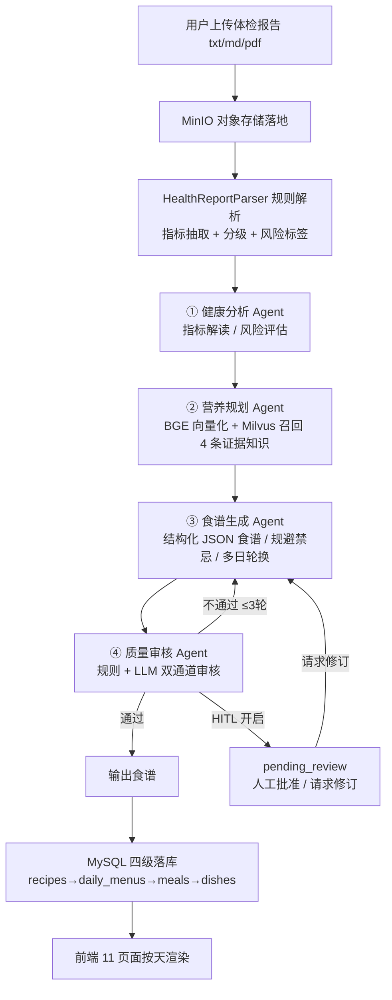
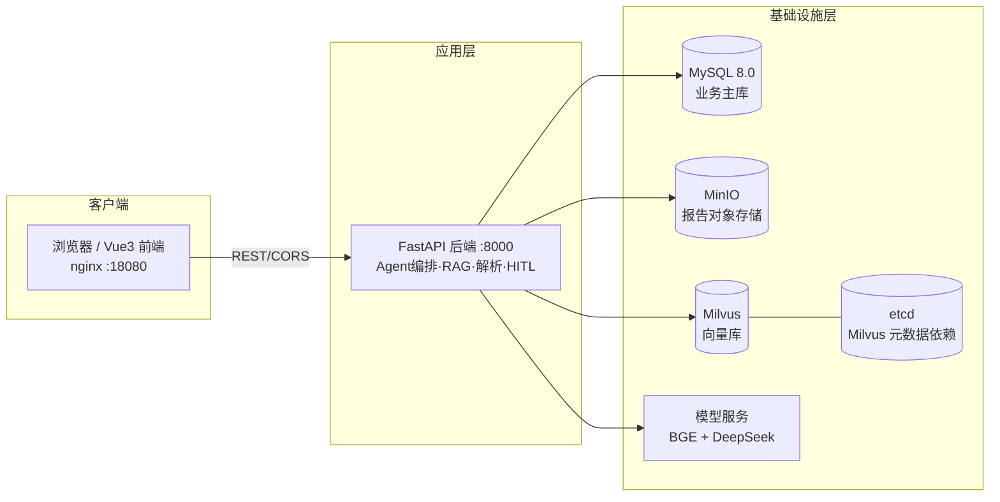

# 智膳参谋（AI 营养师 Agent）· 架构分析

> 本文档基于项目真实代码（`backend/app/**`、 `docker-compose.yml`）梳理，所有节点均可在源码溯源，未做推断夸大。

## 1. 项目定位

面向体检指标异常、具备膳食健康管理意识的普通用户，打造"上传体检报告 → 多 Agent 协作分析 → 输出可执行个性化食谱"的一体化平台；通过 RAG 检索增强（建议标注证据来源与等级）与人工确认闸门（HITL）保障内容有据可查、可控可信。

## 2. 实现流程（端到端）

### 阶段说明

1. **上传与解析**：报告文件经 MinIO 落地；`HealthReportParser` 抽取血糖/血压/尿酸/胆固醇/甘油三酯等核心指标，自动分级生成风险标签与 `risk_tags`。
2. **多 Agent 协作（LangGraph `StateGraph`）**：
   - ① 健康分析 Agent（`_health_analysis_agent`）：解读指标、给风险评估与饮食关注点，LLM 缺失时回退规则模板。
   - ② 营养规划 Agent（`_nutrition_planning_agent`）：BGE 向量化查询 → Milvus 语义检索召回 **4 条带证据等级 A/B/C** 知识，结合偏好估算目标热量，制定方案。
   - ③ 食谱生成 Agent（`_recipe_generation_agent`）：生成结构化 JSON 食谱，规避忌口/过敏/健康禁忌；多日场景按 `day_index % 7` 轮换主菜。
   - ④ 质量审核 Agent（`_quality_review_agent`）：规则 + LLM 双通道；不通过则条件回边重做（`MAX_REVIEW_ITERATIONS=3`，超限带风险提示放行防死循环）。
3. **HITL 闸门**（`HUMAN_REVIEW_GATE=true`）：审核后进入 `pending_review`，前端"批准"生效或"请求修订"触发受控重做（`revision_count`），杜绝无监督自动放行。
4. **落库与展示**：四级结构化落 MySQL；前端按天切换渲染；支持 7/30/90 天多周期 + 7 天主菜轮换池。

## 3. 系统架构（分层）

### 关键依赖事实

- **etcd**：仅作为 Milvus standalone 的元数据依赖组件（`docker-compose.yml` 注释明确），后端代码零引用，非应用直连。
- **向量库**：`knowledge_base.py` 优先 Milvus（IVF_FLAT / IP 度量），连接失败自动降级为进程内余弦相似度检索，接口完全一致。
- **Embedding**：BGE `bge-small-zh-v1.5`，512 维，本地推理（`embeddings.py`）。
- **LLM**：默认 DeepSeek（兼容 OpenAI 协议），未配置 Key 时 `_build_llm` 返回 None，全链路回退规则引擎。

## 4. 关键设计亮点

| 设计点 | 实现 | 价值 |
|--------|------|------|
| 五层降级 | Milvus→内存检索、MySQL→SQLite、MinIO→本地磁盘、BGE→兜底向量、LLM→规则引擎 | 零外部依赖也能跑通全链路 |
| 证据标注 | 知识库每条标注 `evidence_level` A/B/C，注入 LLM 与 fallback 方案 | 建议可溯源、可信 |
| HITL 闸门 | 审核后 `pending_review`，人工批准/修订，记录 `revision_count` | 杜绝无监督自动放行 |
| 条件回边 | `_should_revise` 判断，最多 3 轮，超限带风险提示 | 防死循环、控成本 |
| 多周期 + 轮换 | `cycle_type` week/month/custom，`MENU_MAX_DAYS=90`，`day_index%7` 轮换池 | 方案实用、可坚持 |
| 结构化落库 | recipes→daily_menus→meals→dishes 四级 | 前端按天灵活渲染 |

## 5. 关键配置（docker-compose / config）

- 数据库：`DATABASE_URL=mysql+pymysql://...@mysql:3306/ai_nutritionist`
- 向量库：`VECTOR_DB_TYPE=milvus`、`MILVUS_HOST=milvus:19530`
- 对象存储：`MINIO_ENDPOINT=minio:9000`、bucket `ai-nutritionist-uploads`
- 模型：`EMBEDDING_MODEL=BAAI/bge-small-zh-v1.5`、`EMBEDDING_DIM=512`
- LLM：`OPENAI_BASE_URL=https://api.deepseek.com/v1`、`LLM_MODEL=deepseek-chat`
- HITL / 菜单：`HUMAN_REVIEW_GATE=true`、`MAX_REVISION_REQUESTS=3`、`MENU_MAX_DAYS=7`（容器内演示值，源码默认 90）
- CORS：`CORS_ORIGINS=http://localhost:18080,http://localhost:5173`

## 6. 与简历项目经验的呼应

- 简历「工作内容·多 Agent 工作流编排」对应第 2 节四节点与条件回边。
- 简历「RAG 知识库建设」对应第 2 节 ② 与 `evidence_level` 证据标注。
- 简历「HITL 人工确认闸门」对应第 2 节 ③ 与第 4 节表。
- 简历「工程化与降级设计」对应第 4 节五层降级。
- 简历「多周期食谱与菜品轮换」对应第 2/4 节 `cycle_type` 与 `day_index%7`。
